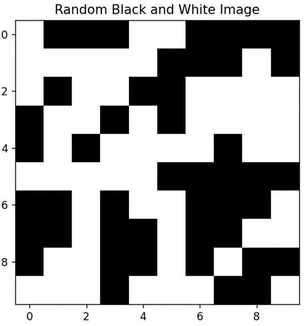

# Constant Area Coding (CAC) with Genetic Algorithm

## Project Overview
This project demonstrates the implementation of a sophisticated data encoding technique called Constant Area Coding (CAC) for image compression using a Genetic Algorithm. CAC is designed to ensure that encoded data occupies a constant area, enabling efficient and consistent storage space utilization, particularly useful in real-time applications requiring constant data flow.


## Table of Contents
1. [Introduction](#introduction)
    - [Constant Area Coding (CAC)](#Constant-Area-Coding-(CAC))
    - [Genetic Algorithm](#Genetic-Algorithm) 
2. [Code Structure](#Code-Structure)
    - [Main Components](#Main-Components)
    - [Genetic Algorithm Operations](#Genetic-Algorithm-Operations)
3. [Results](#Results)


## Introduction
### Constant Area Coding (CAC)
CAC is a data encoding method used primarily for image and video compression. It divides an image or video frame into uniformly sized parts and encodes each region to occupy the same predetermined area. This approach offers advantages such as simplified data management, reduced computational complexity, and predictable memory requirements.
<p align="center">

</p>
<p align = "center">
Example of a randomly generated image
</p>

### Genetic Algorithm
The Genetic Algorithm (GA) is employed to optimize the selection of kernel dimensions for encoding the image using CAC. The algorithm iterates through a series of steps to evolve the best possible solution for image compression.

## Code Structure
### Main Components
Fitness Function: Evaluates the suitability of different kernel dimensions for encoding an image.
Constant Area Coding: Applies the CAC method to an image, dividing it into blocks and encoding each block.

### Genetic Algorithm Operations:
Selection: Selects the most fit chromosomes for reproduction.
Crossover: Performs crossover between two parent chromosomes to generate offspring.
Mutation: Introduces random changes to a chromosome to maintain genetic diversity.
Utility Functions: Helper functions for decoding binary representations, concatenating chromosomes, and reconstructing the original image.


## Results
The algorithm evolves the population over several epochs, selecting the best kernel dimensions for image compression. The output includes the fitness values at each epoch and the final encoded and decoded image.
Here is a sample output of 10 epochs:
```
ORIGINAL P, Q:
P: [13, 1, 5, 3, 5, 0, 5, 1]
Q: [3, 13, 4, 0, 13, 3, 0, 5]
VALUE AT 0 IS OMITTED: KERNEL_H=13, KERNEL_W=3
VALUE AT 1 IS OMITTED: KERNEL_H=1, KERNEL_W=13
VALUE AT 2 IS OMITTED: KERNEL_H=5, KERNEL_W=4
VALUE AT 3 IS OMITTED: KERNEL_H=3, KERNEL_W=0
VALUE AT 4 IS OMITTED: KERNEL_H=5, KERNEL_W=13
VALUE AT 5 IS OMITTED: KERNEL_H=0, KERNEL_W=3
VALUE AT 6 IS OMITTED: KERNEL_H=5, KERNEL_W=0
FITNESS AT EPOCH 9: [-1, -1, -1, -1, -1, -1, -1, 5.0]
VALUE AT 0 IS OMITTED: KERNEL_H=13, KERNEL_W=3
VALUE AT 1 IS OMITTED: KERNEL_H=1, KERNEL_W=13
VALUE AT 2 IS OMITTED: KERNEL_H=5, KERNEL_W=4
VALUE AT 3 IS OMITTED: KERNEL_H=3, KERNEL_W=0
VALUE AT 4 IS OMITTED: KERNEL_H=5, KERNEL_W=13
VALUE AT 5 IS OMITTED: KERNEL_H=0, KERNEL_W=3
VALUE AT 6 IS OMITTED: KERNEL_H=5, KERNEL_W=0
FITNESS AT LAST EPOCH: [5.0, -1, -1, -1, -1, -1, -1, -1]
NEW P, Q:
P: [1, 5]
Q: [5, 13]
END OF EPOCH LAST EPOCH
```
